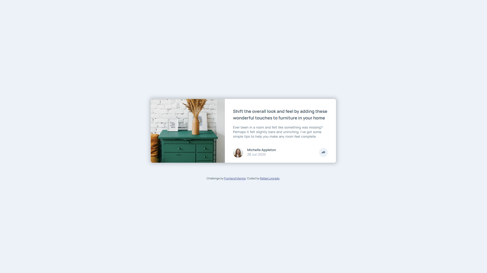
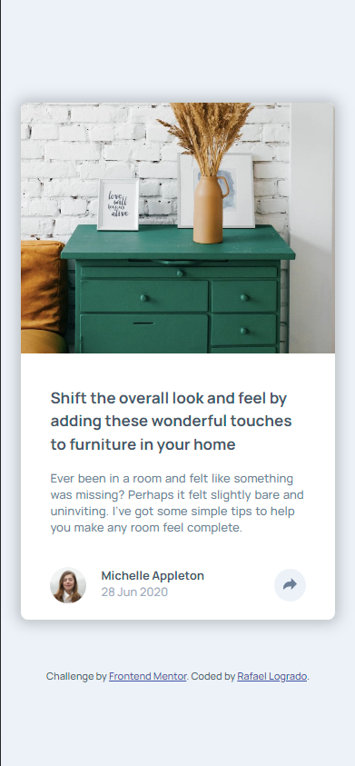

# Frontend Mentor - Article preview component solution

This is a solution to the [Article preview component challenge on Frontend Mentor](https://www.frontendmentor.io/challenges/article-preview-component-dYBN_pYFT).

## Table of contents

- [Overview](#overview)
  - [The challenge](#the-challenge)
  - [Screenshot](#screenshot)
  - [Links](#links)
- [My process](#my-process)
  - [Built with](#built-with)
  - [What I learned](#what-i-learned)
  - [Continued development](#continued-development)
- [Author](#author)


## Overview

### The challenge

Users should be able to:

- View the optimal layout for the component depending on their device's screen size
- See the social media share links when they click the share icon

### Screenshot





### Links

- Solution URL: [Add solution URL here](https://https://github.com/kyuugoko/article-preview-component)
- Live Site URL: [Add live site URL here](https://sage-alfajores-0596e7.netlify.app)


## My process

### Built with

- [HTML5](https://img.shields.io/badge/HTML5-E34F26?style=for-the-badge&logo=html5&logoColor=white)
- [CSS](https://img.shields.io/badge/CSS3-1572B6?style=for-the-badge&logo=css3&logoColor=white)
- [Sass](https://img.shields.io/badge/Sass-CC6699?style=for-the-badge&logo=sass&logoColor=whit)
- [JavaScript](https://img.shields.io/badge/JavaScript-F7DF1E?style=for-the-badge&logo=javascript&logoColor=black)


### What I learned

The way the ```window```target works and how the ```DOMCOntentnLoaded``` event fires everything cleanly became a must for this challenge. Didn't know about them but it really helped sorting the way how the toggles in my JS file were firing immediately upon going live.

`window.addEventListener('DOMContentLoaded', () => {
    classSwitch()
})`


### Continued development

First time implementing JavaScript, not a hard exercise to use it on butfor a first it was definitely a hurdle.
The SASS structure and organization needs refinement, but even more so the documentation aspect of the challenge.


## Author

- Linkedin - [Rafael Logrado](https://www.linkedin.com/in/rafael-logrado/)
- Frontend Mentor - [@kyuugoko](https://www.frontendmentor.io/profile/kyuugoko)
